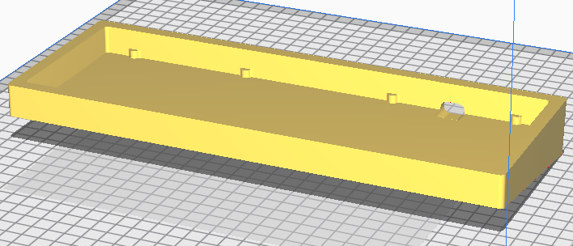

# g60

A simple 3d-printable oring gasket keyboard.

## Known issues

Depending on 3d print tolerances, plate and PCB edges might scratch against the corners of the case. Ideally, the outlines of both should be reduced a little bit. Unfortunately, these changes will not be done as a result of me losing interest in the project due to availability of [Bakeneko](https://github.com/kkatano/bakeneko-60-aluminum-case).

## Compatibility

The PCB is not compatible with other cases due to custom mounting point cutouts and USB position. In turn, the case is also not compatible with any third-party PCBs.

## Oring size

Around 180mm ID and 3.5mm CS, for example  AS568-263 should work fine.

## Machinability

The case should be machinable, however it was not tested and I cannot suggest getting it machined due to extremely simplistic design (ie just make a Bakeneko instead).

## License

This project is licensed under [CC0](https://creativecommons.org/share-your-work/public-domain/cc0/), see the LICENSE file for more details, or [tldrlegal.com](https://tldrlegal.com/license/creative-commons-cc0-1.0-universal) for a summary.
